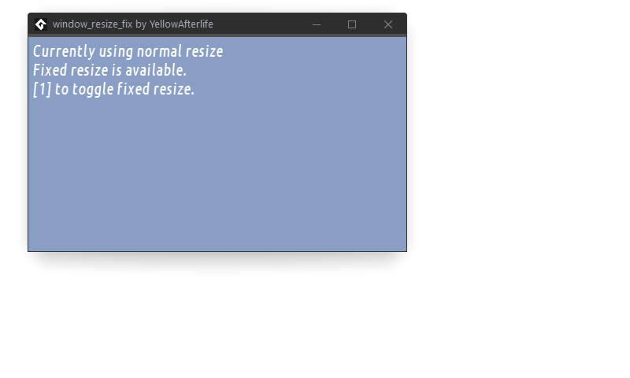

# window_resize_fix

Makes window resizing behaviour in GameMaker Studio 1.4 (1.4.1804 and 1.4.9999) and GameMaker Studio 2.3+ less cursed.

## Installing

- **GameMaker: Studio:**  
  Import the GMEZ by right-clicking Extensions folder in resource tree and picking "Import extension"
- **GameMaker Studio 2.3**
  Import the YYMPS by drag and dropping it onto your workspace or picking menu:Tools➜Import Local Package

## Caveats

* **pre-2.3 GMS2 support**  
  For versions of GameMaker before GMS2.3 (which introduced official support for function references and structs), the extension relies on [this trick](https://github.com/YAL-GameMaker/function_get_address/), which relies on a bug that was fixed in GMS2.2.2. There is no _good_ workaround to this as far as I can tell.
* **x64 support**  
  The extension relies on parsing ASM instructions inside two GameMaker functions to locate an internal variable and a function, which is done with help of `x86_size.cpp`. As per name, `x86_size` cannot parse x64 instructions, and I'm not aware of any other compact implementation that would allow to do this.

## Meta

**Author:** [YellowAfterlife](https://github.com/YellowAfterlife)  
**License:** MIT